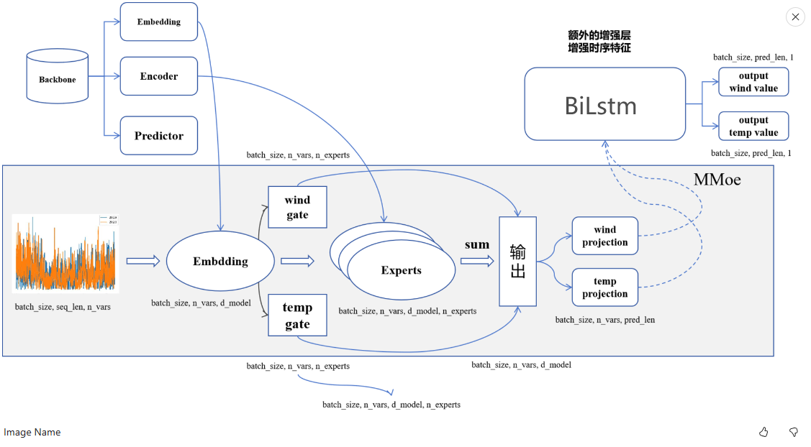

# bigdata24
bigdata code

## 代码说明

环境配置（必选）

python == 3.7

pytorch == 1.10.2

Cuda == 11.3.1

pyyaml == 6.0.1

scikit-learn == 1.2.2

scipy == 1.11.4

## 算法（必选）
itransformer - MMOE

## 整体思路介绍（必选）
将itransformer的encoder作为三个专家同时预测wind和temp，然后再额外设置两个gate对三个专家的结果进行加权求和，对两个结果再通过bilstm，同时预测wind和temp。

## 网络结构

@原图来自 bigdata24周周星男枪哥的分享 https://www.heywhale.com/org/bdc/competition/forum/668e8f29331d96ac496327f2

## 损失函数
loss wind和temp的mse

## 数据扩增
对协变量在时间方向上进行插值

## 模型集成
通过站点进行5折划分，并求均值，前三个epoch加权求均值
